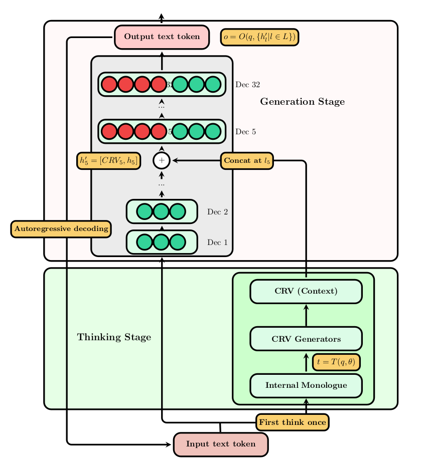

# Neural Integration of Iterative Reasoning (NIR) in LLMs for Code Generation

<p>Pytorch implementation for NIR.</p>

<table>
    <tr>
        <td width="50%">
            
        </td>
        <td width="50%">
            <h2>Neural Integration of Iterative Reasoning (NIR)</h2>
            <ul>
                <li><strong>Project Website:</strong> <a href="https://soran-ghaderi.github.io/nir/">Official Site</a></li>
                <li><strong>Author Website:</strong> <a href="https://soran-ghaderi.github.io/">Soran Ghaderi</a></li>
                <li><strong>Email:</strong> soran.ghaderi.ac@gmail.com</li>
                <li><strong>University:</strong> University of Essex</li>
                <li><strong>Year:</strong> 2024</li>
            </ul>
        </td>
    </tr>
</table>

## Citation
```bibtex
@MastersThesis{soran_2024_essex,
    author    = {Ghaderi, Soran},
    title     = {Neural Integration of Iterative Reasoning (NIR) in LLMs for Code Generation},
    school    = {University of Essex},
    year      = {2024}
    type      = "Master's Thesis",
}
```

## Prerequisites & Dependencies & Running the Codes

**Note:** Ensure dependencies are installed before running.

```bash
# Create virtual environment
python -m venv venv
source venv/bin/activate

# Install dependencies
pip install -r requirements.txt
```

**Important:** To use the Llama 3.1 model, you'll need a token:
1. Create a HuggingFace account
2. Request an access token
3. Use the token in the notebooks and *.py files

### Notebooks (Recommended)
Run notebooks in order:
1. `preprocess_dataset.ipynb`
2. `evaluation.ipynb`
3. `analysis.ipynb`

### Python Scripts (Alternative)
Run scripts in sequence:
1. `preprocess_dataset.py`
2. `final_evals.py`
3. `analysis.py`

**Experimental implementations:** Please note that none of the experimental implementations are included in the evaluations
nor in the dissertation report. They also need minor changes and further modification to be actually useful.

Memory manager, using CRV retrieval, 
similarity-based retrieval, a differential neural computers adaptation.
